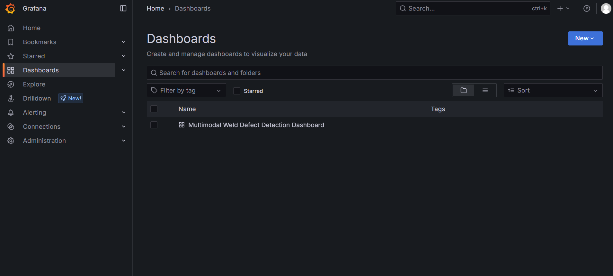
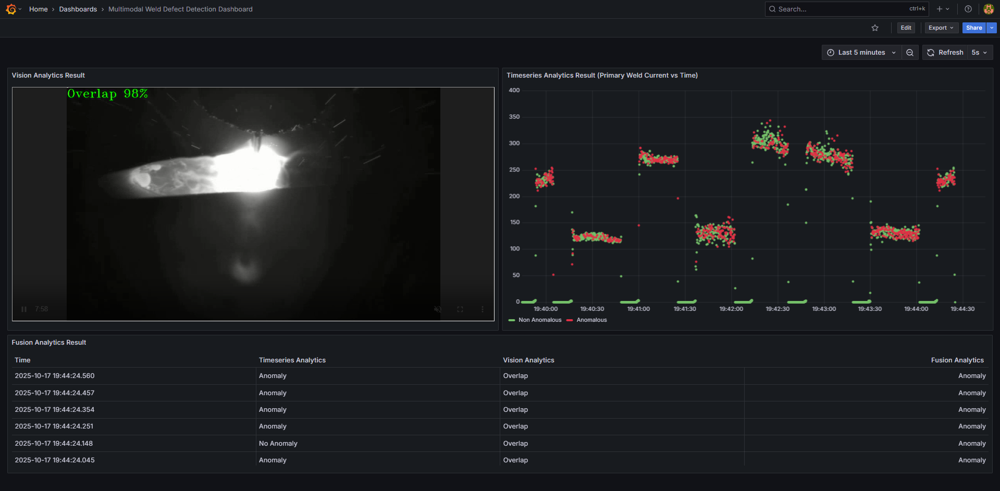

# Get Started

- **Time to Complete:** 30 minutes
- **Programming Language:**  Python 3

## Configure Docker

To configure Docker:

1. **Run Docker as Non-Root**: Follow the steps in
   [Manage Docker as a non-root user](https://docs.docker.com/engine/install/linux-postinstall/#manage-docker-as-a-non-root-user).
2. **Configure Proxy (if required)**:
   - Set up proxy settings for Docker client and containers as described in
     [Docker Proxy Configuration](https://docs.docker.com/network/proxy/).
   - Example `~/.docker/config.json`:

     ```json
     {
       "proxies": {
         "default": {
           "httpProxy": "http://<proxy_server>:<proxy_port>",
           "httpsProxy": "http://<proxy_server>:<proxy_port>",
           "noProxy": "127.0.0.1,localhost"
         }
       }
     }
     ```

   - Configure the Docker daemon proxy as per
     [Systemd Unit File](https://docs.docker.com/engine/daemon/proxy/#systemd-unit-file).
3. **Enable Log Rotation**:
   - Add the following configuration to `/etc/docker/daemon.json`:

     ```json
     {
       "log-driver": "json-file",
       "log-opts": {
         "max-size": "10m",
         "max-file": "5"
       }
     }
     ```

   - Reload and restart Docker:

     ```bash
     sudo systemctl daemon-reload
     sudo systemctl restart docker
     ```

## Clone source code

```bash
git clone https://github.com/open-edge-platform/edge-ai-suites.git
cd edge-ai-suites/manufacturing-ai-suite/industrial-edge-insights-multimodal
```

## Deploy with Docker Compose

1. Update the following fields in `.env`.

   - `INFLUXDB_USERNAME`
   - `INFLUXDB_PASSWORD`
   - `VISUALIZER_GRAFANA_USER`
   - `VISUALIZER_GRAFANA_PASSWORD`
   - `MTX_WEBRTCICESERVERS2_0_USERNAME`
   - `MTX_WEBRTCICESERVERS2_0_PASSWORD`
   - `HOST_IP`

2. Deploy the sample app, use only one of the following options.

   > **NOTE**:
   >
   > - The below `make up` fails if the above required fields are not populated
   >   as per the rules called out in `.env` file.
   > - The sample app is deployed by pulling the pre-built container images of the sample app
   >   from the docker hub OR from the internal container registry (login to the docker registry from cli and configure `DOCKER_REGISTRY`
   >   env variable in `.env` file at `edge-ai-suites/manufacturing-ai-suite/industrial-edge-insights-multimodal`)
   > - The `CONTINUOUS_SIMULATOR_INGESTION` variable in the `.env` file (for Docker Compose) and in `helm/values.yaml` (for Helm deployments)
   >   is set to `true` by default, enabling continuous looping of simulator data. To ingest the simulator data only once (without looping),
   >   set this variable to `false`.
   > - The update rate of the graph and table may lag by a few seconds and might not perfectly align with the video stream, since
   >   Grafana’s minimum refresh interval is 5 seconds.
   > - The graph and table may initially display "No Data" because the Time Series Analytics Microservice requires some time to
   >   install its dependency packages before it can start running.

   ```bash
   cd <PATH_TO_REPO>/edge-ai-suites/manufacturing-ai-suite/industrial-edge-insights-multimodal
   make up
   ```

3. Use the following command to verify that all containers are active and error-free.

   > **Note:** The command `make status` may show errors in containers like ia-grafana when user have not logged in
   > for the first login OR due to session timeout. Just login again in Grafana and functionality wise if things are working, then
   > ignore `user token not found` errors along with other minor errors which may show up in Grafana logs.

   ```sh
   cd <PATH_TO_REPO>/edge-ai-suites/manufacturing-ai-suite/industrial-edge-insights-multimodal
   make status
   ```

## Verify the Weld Defect Detection Results

1. Get into the InfluxDB* container.

   > **Note**: Use `kubectl exec -it <influxdb-pod-name> -n <namespace> -- /bin/bash` for the helm deployment
   > where for <namespace> replace with namespace name where the application was deployed and
   > for <influxdb-pod-name> replace with InfluxDB pod name.

   ``` bash
    docker exec -it ia-influxdb bash
   ```

2. Run following commands to see the data in InfluxDB*.

    > **NOTE**:
    > Please ignore the error message `There was an error writing history file: open /.influx_history: read-only file system` happening in the InfluxDB shell.
    > This does not affect any functionality while working with the InfluxDB commands

    ``` bash
    # For below command, the INFLUXDB_USERNAME and INFLUXDB_PASSWORD needs to be fetched from `.env` file
    # for docker compose deployment and `values.yml` for helm deployment
    influx -username <username> -password <passwd>
    use datain # database access
    show measurements
    # Run below query to check and output measurement processed
    # by Time Series Analytics microservice
    select * from "weld-sensor-anomaly-data"
    ```

3. Check the output in Grafana.

    - Use link `http://<host_ip>:3000` to launch Grafana from browser (preferably, chrome browser)

      > **Note**: Use link `http://<host_ip>:30001` to launch Grafana from browser (preferably, chrome browser) for the helm deployment

    - Login to the Grafana with values set for `VISUALIZER_GRAFANA_USER` and `VISUALIZER_GRAFANA_PASSWORD`
      in `.env` file and select **Multimodal Weld Defect Detection Dashboard**.

      

    - After login, click on Dashboard
      

    - Select the `Multimodal Weld Defect Detection Dashboard`.
      

    - One will see the below output.

      

## Bring down the sample app

```sh
cd <PATH_TO_REPO>/edge-ai-suites/manufacturing-ai-suite/industrial-edge-insights-multimodal
make down
```

## Check logs - troubleshooting

Check the container logs to catch any failures:

```bash
docker ps
docker logs -f <container_name>
docker logs -f <container_name> | grep -i error
```

## Advanced setup

- [How to build from source and deploy](./how-to-guides/how-to-build-from-source.md): Guide to build from source and docker compose deployment
- [How to configure MQTT alerts](./how-to-guides/how-to-configure-alerts.md): Guide for configuring the MQTT alerts in the Time Series Analytics microservice
- [How to update config](./how-to-guides/how-to-update-config.md): Guide updating configuration of Time Series Analytics Microservice.
