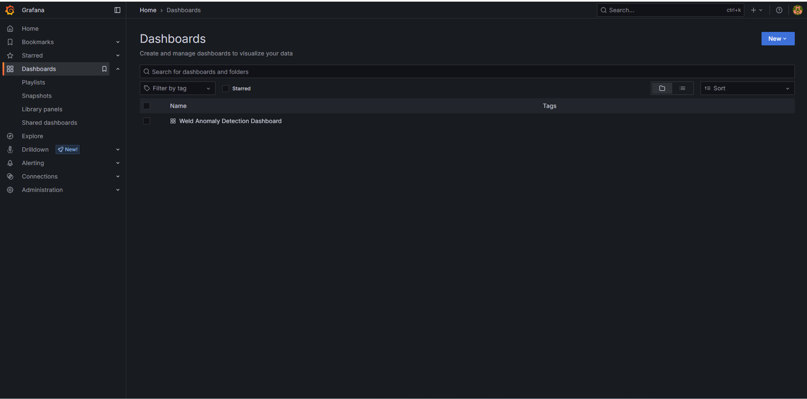
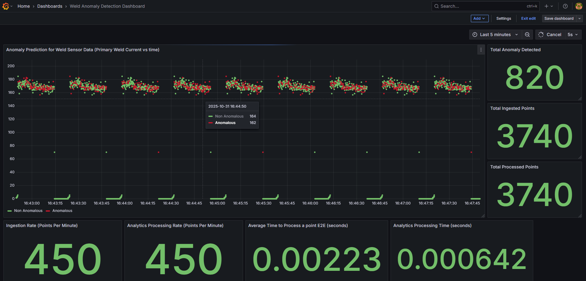

# Get Started

- **Time to Complete:** 30 minutes
- **Programming Language:**  Python 3

## Configure Docker

To configure Docker:

1. **Run Docker as Non-Root**: Follow the steps in [Manage Docker as a non-root user](https://docs.docker.com/engine/install/linux-postinstall/#manage-docker-as-a-non-root-user).
2. **Configure Proxy (if required)**:
   - Set up proxy settings for Docker client and containers as described in [Docker Proxy Configuration](https://docs.docker.com/network/proxy/).
   - Example `~/.docker/config.json`:

     ```json
     {
       "proxies": {
         "default": {
           "httpProxy": "http://<proxy_server>:<proxy_port>",
           "httpsProxy": "http://<proxy_server>:<proxy_port>",
           "noProxy": "127.0.0.1,localhost"
         }
       }
     }
     ```

   - Configure the Docker daemon proxy as per [Systemd Unit File](https://docs.docker.com/engine/daemon/proxy/#systemd-unit-file).
3. **Enable Log Rotation**:
   - Add the following configuration to `/etc/docker/daemon.json`:

     ```json
     {
       "log-driver": "json-file",
       "log-opts": {
         "max-size": "10m",
         "max-file": "5"
       }
     }
     ```

   - Reload and restart Docker:

     ```bash
     sudo systemctl daemon-reload
     sudo systemctl restart docker
     ```

## Clone source code

```bash
git clone https://github.com/open-edge-platform/edge-ai-suites.git
git checkout release-2025.2.0
cd edge-ai-suites/manufacturing-ai-suite/industrial-edge-insights-time-series
```

## Deploy with Docker Compose

1. Update the following fields in `.env`:
   - `INFLUXDB_USERNAME`
   - `INFLUXDB_PASSWORD`
   - `VISUALIZER_GRAFANA_USER`
   - `VISUALIZER_GRAFANA_PASSWORD`

2. Deploy the sample app, use only one of the following options:

> **NOTE**:
>
> - The below `make up_opcua_ingestion` or `make up_mqtt_ingestion` fails if the above required fields are not populated
>   as per the rules called out in `.env` file.
> - The sample app is deployed by pulling the pre-built container images of the sample app
>   from the docker hub OR from the internal container registry (login to the docker registry from cli and configure `DOCKER_REGISTRY`
>   env variable in `.env` file at `edge-ai-suites/manufacturing-ai-suite/industrial-edge-insights-time-series`)
> - The `CONTINUOUS_SIMULATOR_INGESTION` variable in the `.env` file (for Docker Compose) and in `helm/values.yaml` (for Helm deployments)
>   is set to `true` by default, enabling continuous looping of simulator data. To ingest the simulator data only once (without looping),
>   set this variable to `false`.
> - If `CONTINUOUS_SIMULATOR_INGESTION` is set to `false`, you may see the `[inputs.opcua] status not OK for node` message in the `telegraf`
>   logs for OPC-UA ingestion after a single data ingestion loop. This message can be ignored.
> - `make up_opcua_ingestion` is supported only for `Wind Turbine Anomaly Detection` sample app

::::{tab-set}
:::{tab-item} **Wind Turbine Anomaly Detection**
:sync: tab1

- **Using OPC-UA ingestion**:

   ```bash
   make up_opcua_ingestion app="wind-turbine-anomaly-detection"
   ```

- **Using MQTT ingestion**:

   ```bash
   make up_mqtt_ingestion app="wind-turbine-anomaly-detection"
   ```

:::
:::{tab-item} **Weld Anomaly Detection**
:sync: tab2

```bash
make up_mqtt_ingestion app="weld-anomaly-detection"
```

:::
::::

### Multi-Stream Ingestion support

Multi-stream ingestion enables the simultaneous processing of multiple data streams, improving throughput and scalability.

To activate multi-stream ingestion, set the `num_of_streams` parameter to the required number of parallel streams when deploying the application.
`<NUMBER_OF_STREAMS>`: Specify the number of parallel streams to run (e.g., `3` for three concurrent streams).

::::{tab-set}
:::{tab-item} **Wind Turbine Anomaly Detection**
:sync: tab1

```bash
# Deploy with OPC-UA Multi-Stream Ingestion
make up_opcua_ingestion app="wind-turbine-anomaly-detection" num_of_streams=<NUMBER_OF_STREAMS>

# Deploy with MQTT Multi-Stream Ingestion
make up_mqtt_ingestion app="wind-turbine-anomaly-detection" num_of_streams=<NUMBER_OF_STREAMS>
```

:::
:::{tab-item} **Weld Anomaly Detection**
:sync: tab2

```bash
# Deploy with MQTT Multi-Stream Ingestion
make up_mqtt_ingestion app="weld-anomaly-detection" num_of_streams=<NUMBER_OF_STREAMS>
```

:::
::::

#### Notes

- Ensure system resources (CPU, memory) are sufficient to support the desired number of streams.
- For troubleshooting or monitoring, use `make status` to verify container health and logs.

  > **Note:** The command `make status` may show errors in containers like ia-grafana when user have not logged in
  > for the first login OR due to session timeout. Just login again in Grafana and functionality wise if things are working, then
  > ignore `user token not found` errors along with other minor errors which may show up in Grafana logs.

  ```sh
  make status
  ```

### Running User Defined Function(UDF) inference on GPU

By default, UDF for both the sample apps is configured to run on `CPU`.
The `Wind Turbine Anomaly Detection` sample app ML model can run on `iGPU` while
the `Weld Anomaly Detection` sample app ML model can only run on `CPU`.

To trigger the UDF inference on GPU in Time Series Analytics Microservice, run the following command:

```sh
 curl -k -X 'POST' \
 'https://<HOST_IP>:3000/ts-api/config' \
 -H 'accept: application/json' \
 -H 'Content-Type: application/json' \
 -d '<Add contents of edge-ai-suites/manufacturing-ai-suite/industrial-edge-insights-time-series/apps/wind-turbine-anomaly-detection/time-series-analytics-config/config.json with device
     value updated to gpu from cpu>'
```

## Verify the Output Results

::::{tab-set}
:::{tab-item} **Wind Turbine Anomaly Detection**
:sync: tab1

1. Get into the InfluxDB* container:

   > **Note**: Use `kubectl exec -it <influxdb-pod-name> -n <namespace> -- /bin/bash` for the helm deployment
   > where for <namespace> replace with namespace name where the application was deployed and
   > for <influxdb-pod-name> replace with InfluxDB pod name.

   ``` bash
    docker exec -it ia-influxdb bash
   ```

2. Run following commands to see the data in InfluxDB*:

   > **NOTE**:
   > Please ignore the error message `There was an error writing history file: open /.influx_history: read-only file system` happening in the InfluxDB shell.
   > This does not affect any functionality while working with the InfluxDB commands

   ``` bash
   # For below command, the INFLUXDB_USERNAME and INFLUXDB_PASSWORD needs to be fetched from `.env` file
   # for docker compose deployment and `values.yml` for helm deployment
   influx -username <username> -password <passwd>
   use datain # database access
   show measurements
   # Run below query to check and output measurement processed
   # by Time Series Analytics microservice
   select * from "wind-turbine-anomaly-data"
   ```

3. To check the output in Grafana:

   - Use link `https://<host_ip>:3000/` to launch Grafana from browser (preferably, chrome browser)

     > **Note**: Use link `https://<host_ip>:30001` to launch Grafana from browser (preferably, chrome browser) for the helm deployment

   - Login to the Grafana with values set for `VISUALIZER_GRAFANA_USER` and `VISUALIZER_GRAFANA_PASSWORD`
     in `.env` file and select **Wind Turbine Dashboard**.

     

   - After login, click on Dashboard
     

   - Select the `Wind Turbine Dashboard`.
     

   - You will see the below output.

     

:::
:::{tab-item} **Weld Anomaly Detection**
:sync: tab2

1. Get into the InfluxDB* container:

   > **Note**: Use `kubectl exec -it <influxdb-pod-name> -n <namespace> -- /bin/bash` for the helm deployment
   > where for <namespace> replace with namespace name where the application was deployed and
   > for <influxdb-pod-name> replace with InfluxDB pod name.

   ``` bash
    docker exec -it ia-influxdb bash
   ```

2. Run following commands to see the data in InfluxDB*:

   > **NOTE**:
   > Please ignore the error message `There was an error writing history file: open /.influx_history: read-only file system` happening in the InfluxDB shell.
   > This does not affect any functionality while working with the InfluxDB commands

   ``` bash
   # For below command, the INFLUXDB_USERNAME and INFLUXDB_PASSWORD needs to be fetched from `.env` file
   # for docker compose deployment and `values.yml` for helm deployment
   influx -username <username> -password <passwd>
   use datain # database access
   show measurements
   # Run below query to check and output measurement processed
   # by Time Series Analytics microservice
   select * from "weld-sensor-anomaly-data"
   ```

3. To check the output in Grafana:

   - Use link `https://<host_ip>:3000/` to launch Grafana from browser (preferably, chrome browser)

     > **Note**: Use link `https://<host_ip>:30001` to launch Grafana from browser (preferably, chrome browser) for the helm deployment

   - Login to the Grafana with values set for `VISUALIZER_GRAFANA_USER` and `VISUALIZER_GRAFANA_PASSWORD`
     in `.env` file and select **Wind Turbine Dashboard**.

     

   - After login, click on Dashboard
     

   - Select the `Weld Anomaly Detection Dashboard`.
     

   - One will see the below output.

     

:::
::::

## Bring down the sample app

```sh
make down
```

## Check logs - troubleshooting

Check container logs to catch any failures:

```bash
docker ps
docker logs -f <container_name>
docker logs -f <container_name> | grep -i error
```

## Other Deployment options

See [How to Deploy with Helm](./how-to-guides/how-to-deploy-with-helm.md)
guide to learn how to deploy the sample application on a k8s cluster using Helm.

## Advanced setup

- [How to build from source and deploy](./how-to-guides/how-to-build-from-source.md): Guide to build from source and docker compose deployment
- [How to configure OPC-UA/MQTT alerts](./how-to-guides/how-to-configure-alerts.md): Guide for configuring the OPC-UA/MQTT alerts in the Time Series Analytics microservice
- [How to configure custom UDF deployment package](./how-to-guides/how-to-configure-custom-udf.md): Guide for deploying a customized UDF deployment package (udfs/models/tick scripts)
