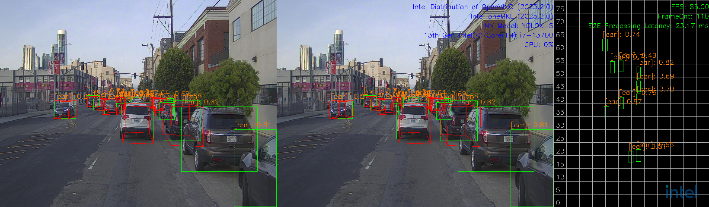
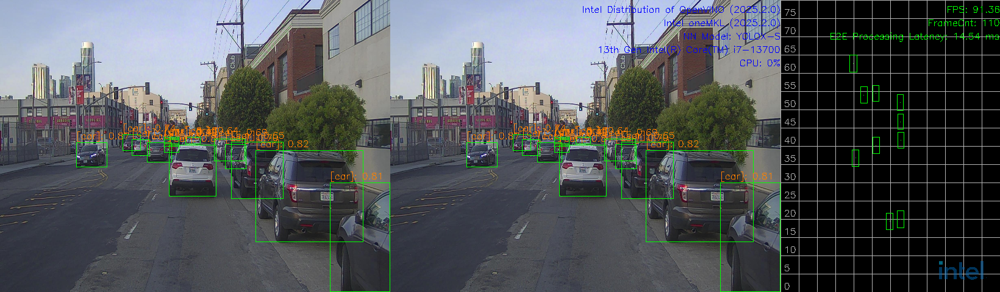
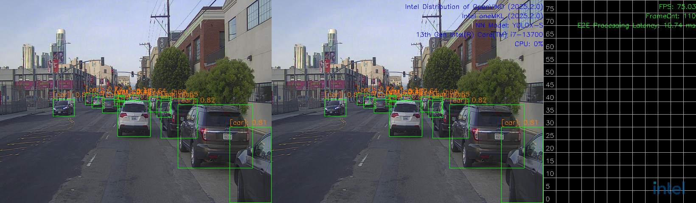
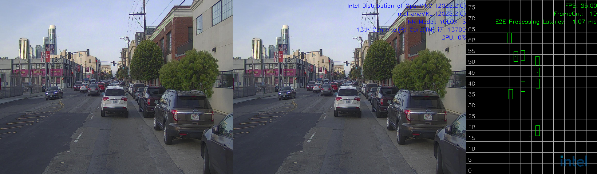
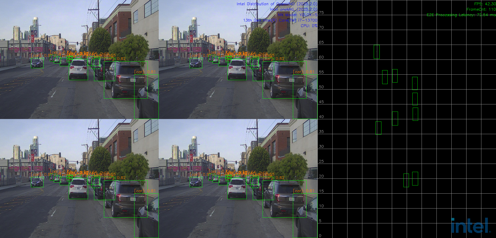
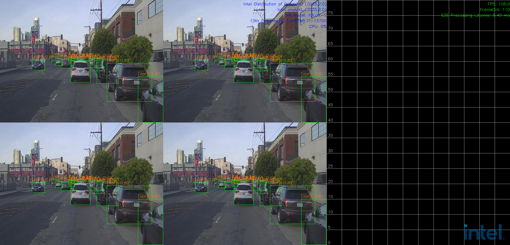
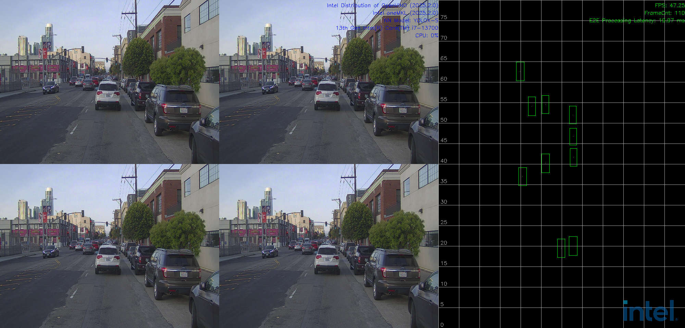

# Advanced User Guide

This document introduces an Intel® software reference implementation (SW RI) for Metro AI Suite Sensor Fusion in Traffic Management. It combines camera and lidar data—referred to as ISF "C+L" or AIO "C+L".

The internal project code name is **Garnet Park**.

As shown in Fig.1, the end-to-end pipeline includes the following major blocks (workloads):

-   Loading datasets and converting formats
-   Processing lidar signals
-   Running video analytics
-   Fusing data from lidar and camera
-   Visualization

All these tasks run on single Intel SoC processor which provides all the required heterogeneous computing capabilities. To maximize its performance on Intel processors, we optimized this SW RI using Intel SW tool kits in addition to open-source SW libraries.


<center>(1) Use case: C+L</center>

<center> Figure 1. E2E SW pipelines of sensor fusion C+L(Camera+Lidar).</center>

For prerequisites and system requirements, see [prerequisites.md](./prerequisites.md) and [system-req.md](./system-req.md).

## Architecture Overview

In this section, we describe how to run Intel® Metro AI Suite Sensor Fusion for Traffic Management application.

Intel® Metro AI Suite Sensor Fusion for Traffic Management application can support different pipeline using topology JSON files to describe the pipeline topology. The defined pipeline topology can be found at [Resources](#resources)

There are two steps required for running the sensor fusion application:
- Start AI Inference service, more details can be found at [Service Start ](#service-start)
- Run the application entry program, more details can be found at [Entry Program](#entry-program)

Besides, you can test each component (without display) following the guides at [2C+1L Unit Tests](#2c+1l-unit-tests), [4C+2L Unit Tests](#4c+2l-unit-tests), [12C+2L Unit Tests](#12c+2l-unit-tests), [8C+4L Unit Tests](#8c+4l-unit-tests)


### Resources 
- Local File Pipeline for Media pipeline
  - Json File: localMediaPipeline.json 
    
    > File location: `$PROJ_DIR/ai_inference/test/configs/kitti/1C1L/localMediaPipeline.json`
  - Pipeline Description: 
    ```
    input -> decode -> detection -> tracking -> output
    ```
  
- Local File Pipeline for Lidar pipeline
  - Json File: localLidarPipeline.json
    
    > File location: `$PROJ_DIR/ai_inference/test/configs/kitti/1C1L/localLidarPipeline.json`
- Pipeline Description: 
  
    ```
    input -> lidar signal processing -> output
  ```
  
- Local File Pipeline for `Camera + Lidar(2C+1L)` Sensor fusion pipeline

  - Json File: localFusionPipeline.json
    
    > File location: `$PROJ_DIR/ai_inference/test/configs/kitti/2C1L/localFusionPipeline.json`
  - Pipeline Description: 
    ```
           | -> decode     -> detector         -> tracker                  -> |                                    |
    input  | -> decode     -> detector         -> tracker                  -> | -> LidarCam2CFusion ->  fusion  -> | -> output
           | ->                lidar signal processing                     -> |                                    |
    ```
- Local File Pipeline for `Camera + Lidar(4C+2L)` Sensor fusion pipeline

  - Json File: localFusionPipeline.json
    
    > File location: `$PROJ_DIR/ai_inference/test/configs/raddet/2C1L/localFusionPipeline.json`
  - Pipeline Description: 
    ```
           | -> decode     -> detector         -> tracker                  -> |                                    |
    input  | -> decode     -> detector         -> tracker                  -> | -> LidarCam2CFusion ->  fusion  -> |
           | ->                lidar signal processing                     -> |                                    |
           | -> decode     -> detector         -> tracker                  -> |                                    | -> output
    input  | -> decode     -> detector         -> tracker                  -> | -> LidarCam2CFusion ->  fusion  -> | 
           | ->                lidar signal processing                     -> |                                    |
    ```
  
- Local File Pipeline for `Camera + Lidar(12C+2L)` Sensor fusion pipeline

    - Json File: localFusionPipeline.json
      `File location: ai_inference/test/configs/kitti/6C1L/localFusionPipeline.json`

    - Pipeline Description: 

        ```
               | -> decode     -> detector         -> tracker                  -> |                                    |
               | -> decode     -> detector         -> tracker                  -> |                                    |
               | -> decode     -> detector         -> tracker                  -> |                                    |
        input  | -> decode     -> detector         -> tracker                  -> | ->  LidarCam6CFusion -> fusion  -> | -> output
               | -> decode     -> detector         -> tracker                  -> |                                    |
               | -> decode     -> detector         -> tracker                  -> |                                    |
               | ->                lidar signal processing                     -> |                                    |
        ```

- Local File Pipeline for `Camera + Lidar(8C+4L)` Sensor fusion pipeline

    - Json File: localFusionPipeline.json
      `File location: ai_inference/test/configs/kitti/2C1L/localFusionPipeline.json`

    - Pipeline Description: 

        ```
               | -> decode     -> detector         -> tracker                  -> |                                    |
        input  | -> decode     -> detector         -> tracker                  -> | -> LidarCam2CFusion ->  fusion  -> |
               | ->                lidar signal processing                     -> |                                    |
               | -> decode     -> detector         -> tracker                  -> |                                    |
        input  | -> decode     -> detector         -> tracker                  -> | -> LidarCam2CFusion ->  fusion  -> | 
               | ->                lidar signal processing                     -> |                                    | -> output
               | -> decode     -> detector         -> tracker                  -> |                                    |
        input  | -> decode     -> detector         -> tracker                  -> | -> LidarCam2CFusion ->  fusion  -> | 
               | ->                lidar signal processing                     -> |                                    |
               | -> decode     -> detector         -> tracker                  -> |                                    |
        input  | -> decode     -> detector         -> tracker                  -> | -> LidarCam2CFusion ->  fusion  -> | 
               | ->                lidar signal processing                     -> |                                    |
        ```

### Service Start

Open a terminal, run the following commands:

```bash
cd $PROJ_DIR
sudo bash -x run_service_bare.sh

# Output logs:
    [2023-06-26 14:34:42.970] [DualSinks] [info] MaxConcurrentWorkload sets to 1
    [2023-06-26 14:34:42.970] [DualSinks] [info] MaxPipelineLifeTime sets to 300s
    [2023-06-26 14:34:42.970] [DualSinks] [info] Pipeline Manager pool size sets to 1
    [2023-06-26 14:34:42.970] [DualSinks] [trace] [HTTP]: uv loop inited
    [2023-06-26 14:34:42.970] [DualSinks] [trace] [HTTP]: Init completed
    [2023-06-26 14:34:42.971] [DualSinks] [trace] [HTTP]: http server at 0.0.0.0:50051
    [2023-06-26 14:34:42.971] [DualSinks] [trace] [HTTP]: running starts
    [2023-06-26 14:34:42.971] [DualSinks] [info] Server set to listen on 0.0.0.0:50052
    [2023-06-26 14:34:42.972] [DualSinks] [info] Server starts 1 listener. Listening starts
    [2023-06-26 14:34:42.972] [DualSinks] [trace] Connection handle with uid 0 created
    [2023-06-26 14:34:42.972] [DualSinks] [trace] Add connection with uid 0 into the conn pool

```
> NOTE-1: workload (default as 4) can be configured in file: `$PROJ_DIR/ai_inference/source/low_latency_server/AiInference.config`
```vim
...
[Pipeline]
maxConcurrentWorkload=4
```

> NOTE-2 : to stop service, run the following commands:
```bash
sudo pkill Hce
```

### Entry Program

#### Usage

All executable files are located at: $PROJ_DIR/build/bin

##### entry program with display

```
Usage: CLSensorFusionDisplay <host> <port> <json_file> <total_stream_num> <repeats> <data_path> <display_type> <visualization_type>    [<save_flag: 0 | 1>] [<pipeline_repeats>] [<cross_stream_num>] [<warmup_flag: 0 | 1>] [<logo_flag: 0 | 1>]
--------------------------------------------------------------------------------
Environment requirement:
   unset http_proxy;unset https_proxy;unset HTTP_PROXY;unset HTTPS_PROXY
```
* **host**: use `127.0.0.1` to call from localhost.
* **port**: configured as `50052`, can be changed by modifying file: `$PROJ_DIR/ai_inference/source/low_latency_server/AiInference.config` before starting the service.
* **json_file**: AI pipeline topology file.
* **total_stream_num**: to control the input streams.
* **repeats**: to run tests multiple times, so that we can get more accurate performance.
* **data_path**: multi-sensor binary files folder for input.
* **display_type**: support for `media`, `lidar`, `media_lidar`, `media_fusion` currently.
  * `media`: only show image results in frontview.
  * `lidar`: only show lidar results in birdview.
  * `media_lidar`: show image results in frontview and lidar results in birdview separately.
  * `media_fusion`: show both for image results in frontview and fusion results in birdview.
* **visualization_type**: visualization type of different pipelines, currently support `2C1L`, `4C2L`, `8C4L`, `12C2L`.
* **save_flag**: whether to save display results into video.
* **pipeline_repeats**: pipeline repeats number.
* **cross_stream_num**: the stream number that run in a single pipeline.
* **warmup_flag**: warm up flag before pipeline start.
* **logo_flag**: whether to add intel logo in display.

##### entry program without display

```
Usage: testGRPCCPlusLPipeline <host> <port> <json_file> <total_stream_num> <repeats> <data_path> <media_type> [<pipeline_repeats>] [<cross_stream_num>] [<warmup_flag: 0 | 1>]
--------------------------------------------------------------------------------
Environment requirement:
   unset http_proxy;unset https_proxy;unset HTTP_PROXY;unset HTTPS_PROXY
```

* **host**: use `127.0.0.1` to call from localhost.
* **port**: configured as `50052`, can be changed by modifying file: `$PROJ_DIR/ai_inference/source/low_latency_server/AiInference.config` before starting the service.
* **json_file**: AI pipeline topology file.
* **total_stream_num**: to control the input streams.
* **repeats**: to run tests multiple times, so that we can get more accurate performance.
* **data_path**: multi-sensor binary files folder for input.
* **media_type**: : support for `media`, `multisensor` currently.
* **pipeline_repeats**: pipeline repeats number.
* **cross_stream_num**: the stream number that run in a single pipeline.
* **warmup_flag**: warm up flag before pipeline start.


#### 2C+1L

**The target platform is Intel® Core™ Ultra 7 265H.**

> Note: Run with `root` if users want to get the GPU utilization profiling.
> change /path-to-dataset to your data path.

Please refer to [kitti360_guide.md](../../deployments/how_to_generate_kitti_format_dataset/kitti360_guide.md) for data preparation, or just use demo data in [kitti360](../../ai_inference/test/demo/kitti360/).

- `media_fusion` display type

    open another terminal, run the following commands:

    ```bash
    # multi-sensor inputs test-case
    sudo -E ./build/bin/CLSensorFusionDisplay 127.0.0.1 50052 ai_inference/test/configs/kitti/2C1L/localFusionPipeline.json 1 1 /path-to-dataset media_fusion 2C1L
    ```

    

- `media_lidar` display type

    open another terminal, run the following commands:

    ```bash
    # multi-sensor inputs test-case
    sudo -E ./build/bin/CLSensorFusionDisplay 127.0.0.1 50052 ai_inference/test/configs/kitti/2C1L/localFusionPipeline.json 1 1 /path-to-dataset media_lidar 2C1L
    ```

    

- `media` display type

    open another terminal, run the following commands:

    ```bash
    # multi-sensor inputs test-case
    sudo -E ./build/bin/CLSensorFusionDisplay 127.0.0.1 50052 ai_inference/test/configs/kitti/2C1L/localMediaPipeline.json 1 1 /path-to-dataset media 2C1L
    ```

    

- `lidar` display type

    open another terminal, run the following commands:

    ```bash
    # multi-sensor inputs test-case
    sudo -E ./build/bin/CLSensorFusionDisplay 127.0.0.1 50052 ai_inference/test/configs/kitti/2C1L/localLidarPipeline.json 1 1 /path-to-dataset lidar 2C1L
    ```

    

#### 2C+1L Unit Tests

**The target platform is Intel® Core™ Ultra 7 265H.**

> Note: Run with `root` if users want to get the GPU utilization profiling.
> change /path-to-dataset to your data path.

In this section, the unit tests of three major components will be described: media processing, lidar processing, fusion pipeline without display.

##### Unit Test: Fusion pipeline without display
Open another terminal, run the following commands:
```bash
# fusion test-case
sudo -E ./build/bin/testGRPCCPlusLPipeline 127.0.0.1 50052 ai_inference/test/configs/kitti/2C1L/localFusionPipeline.json 1 1 /path-to-dataset multisensor
```

##### Unit Test: Media Processing

Open another terminal, run the following commands:

```bash
# media test-case
sudo -E ./build/bin/testGRPCCPlusLPipeline 127.0.0.1 50052 ai_inference/test/configs/kitti/2C1L/localMediaPipeline.json 1 1 /path-to-dataset media
```

##### Unit Test: Lidar Processing

Open another terminal, run the following commands:

```bash
# lidar test-case
sudo -E ./build/bin/testGRPCCPlusLPipeline 127.0.0.1 50052 ai_inference/test/configs/kitti/2C1L/localLidarPipeline.json 1 1 /path-to-dataset multisensor
```


#### 4C+2L

**The target platform is Intel® Core™ Ultra 7 265H.**

> Note: Run with `root` if users want to get the GPU utilization profiling.
> change /path-to-dataset to your data path.

- `media_fusion` display type

    open another terminal, run the following commands:

    ```bash
    # multi-sensor inputs test-case
    sudo -E ./build/bin/CLSensorFusionDisplay 127.0.0.1 50052 ai_inference/test/configs/kitti/2C1L/localFusionPipeline.json 2 1 /path-to-dataset media_fusion 4C2L
    ```

    

- `media_lidar` display type

    open another terminal, run the following commands:

    ```bash
    # multi-sensor inputs test-case
    sudo -E ./build/bin/CLSensorFusionDisplay 127.0.0.1 50052 ai_inference/test/configs/kitti/2C1L/localFusionPipeline.json 2 1 /path-to-dataset media_lidar 4C2L
    ```

    

- `media` display type

    open another terminal, run the following commands:

    ```bash
    # multi-sensor inputs test-case
    sudo -E ./build/bin/CLSensorFusionDisplay 127.0.0.1 50052 ai_inference/test/configs/kitti/2C1L/localMediaPipeline.json 2 1 /path-to-dataset media 4C2L
    ```

    

- `lidar` display type

    open another terminal, run the following commands:

    ```bash
    # multi-sensor inputs test-case
    sudo -E ./build/bin/CLSensorFusionDisplay 127.0.0.1 50052 ai_inference/test/configs/kitti/2C1L/localLidarPipeline.json 2 1 /path-to-dataset lidar 4C2L
    ```

    

#### 4C+2L Unit Tests

**The target platform is Intel® Core™ Ultra 7 265H.**

> Note: Run with `root` if users want to get the GPU utilization profiling.
> change /path-to-dataset to your data path.

In this section, the unit tests of three major components will be described: media processing, lidar processing, fusion pipeline without display.

##### Unit Test: Fusion pipeline without display

Open another terminal, run the following commands:

```bash
# fusion test-case
sudo -E ./build/bin/testGRPCCPlusLPipeline 127.0.0.1 50052 ai_inference/test/configs/kitti/2C1L/localFusionPipeline.json 2 1 /path-to-dataset multisensor
```

##### Unit Test: Media Processing

Open another terminal, run the following commands:

```bash
# media test-case
sudo -E ./build/bin/testGRPCCPlusLPipeline 127.0.0.1 50052 ai_inference/test/configs/kitti/2C1L/localMediaPipeline.json 2 1 /path-to-dataset media
```

##### Unit Test: Lidar Processing

Open another terminal, run the following commands:

```bash
# lidar test-case
sudo -E ./build/bin/testGRPCCPlusLPipeline 127.0.0.1 50052 ai_inference/test/configs/kitti/2C1L/localLidarPipeline.json 2 1 /path-to-dataset multisensor
```


#### 12C+2L

***The target platform is Intel® Core™ i7-13700 and Intel® B580 Graphics.**

> Note: Run with `root` if users want to get the GPU utilization profiling.
> change /path-to-dataset to your data path.

- `media_fusion` display type

    open another terminal, run the following commands:

    ```bash
    # multi-sensor inputs test-case
    sudo -E ./build/bin/CLSensorFusionDisplay 127.0.0.1 50052 ai_inference/test/configs/kitti/6C1L/localFusionPipeline.json 2 1 /path-to-dataset media_fusion 12C2L
    ```

    

- `media_lidar` display type

    open another terminal, run the following commands:

    ```bash
    # multi-sensor inputs test-case
    sudo -E ./build/bin/CLSensorFusionDisplay 127.0.0.1 50052 ai_inference/test/configs/kitti/6C1L/localFusionPipeline.json 2 1 /path-to-dataset media_lidar 12C2L
    ```

    

- `media` display type

    open another terminal, run the following commands:

    ```bash
    # multi-sensor inputs test-case
    sudo -E ./build/bin/CLSensorFusionDisplay 127.0.0.1 50052 ai_inference/test/configs/kitti/6C1L/localMediaPipeline.json 2 1 /path-to-dataset media 12C2L
    ```

    

- `lidar` display type

    open another terminal, run the following commands:

    ```bash
    # multi-sensor inputs test-case
    sudo -E ./build/bin/CLSensorFusionDisplay 127.0.0.1 50052 ai_inference/test/configs/kitti/6C1L/localLidarPipeline.json 2 1 /path-to-dataset lidar 12C2L
    ```

    

#### 12C+2L Unit Tests

***The target platform is Intel® Core™ i7-13700 and Intel® B580 Graphics.**

> Note: Run with `root` if users want to get the GPU utilization profiling.
> change /path-to-dataset to your data path.

In this section, the unit tests of three major components will be described: media processing, lidar processing, fusion pipeline without display.

##### Unit Test: Fusion pipeline without display

Open another terminal, run the following commands:

```bash
# fusion test-case
sudo -E ./build/bin/testGRPCCPlusLPipeline 127.0.0.1 50052 ai_inference/test/configs/kitti/6C1L/localFusionPipeline.json 2 1 /path-to-dataset multisensor
```

##### Unit Test: Media Processing

Open another terminal, run the following commands:

```bash
# media test-case
sudo -E ./build/bin/testGRPCCPlusLPipeline 127.0.0.1 50052 ai_inference/test/configs/kitti/6C1L/localMediaPipeline.json 2 1 /path-to-dataset media
```

##### Unit Test: Lidar Processing

Open another terminal, run the following commands:

```bash
# lidar test-case
sudo -E ./build/bin/testGRPCCPlusLPipeline 127.0.0.1 50052 ai_inference/test/configs/kitti/6C1L/localLidarPipeline.json 2 1 /path-to-dataset multisensor
```


#### 8C+4L

***The target platform is Intel® Core™ i7-13700 and Intel® B580 Graphics.**

> Note: Run with `root` if users want to get the GPU utilization profiling.
> change /path-to-dataset to your data path.

- `media_fusion` display type

    open another terminal, run the following commands:

    ```bash
    # multi-sensor inputs test-case
    sudo -E ./build/bin/CLSensorFusionDisplay 127.0.0.1 50052 ai_inference/test/configs/kitti/2C1L/localFusionPipeline.json 4 1 /path-to-dataset media_fusion 8C4L
    ```

    

- `media_lidar` display type

    open another terminal, run the following commands:

    ```bash
    # multi-sensor inputs test-case
    sudo -E ./build/bin/CLSensorFusionDisplay 127.0.0.1 50052 ai_inference/test/configs/kitti/2C1L/localFusionPipeline.json 4 1 /path-to-dataset media_lidar 8C4L
    ```

    

- `media` display type

    open another terminal, run the following commands:

    ```bash
    # multi-sensor inputs test-case
    sudo -E ./build/bin/CLSensorFusionDisplay 127.0.0.1 50052 ai_inference/test/configs/kitti/2C1L/localMediaPipeline.json 4 1 /path-to-dataset media 8C4L
    ```

    

- `lidar` display type

    open another terminal, run the following commands:

    ```bash
    # multi-sensor inputs test-case
    sudo -E ./build/bin/CLSensorFusionDisplay 127.0.0.1 50052 ai_inference/test/configs/kitti/2C1L/localLidarPipeline.json 4 1 /path-to-dataset lidar 8C4L
    ```

    

#### 8C+4L Unit Tests

***The target platform is Intel® Core™ i7-13700 and Intel® B580 Graphics.**

> Note: Run with `root` if users want to get the GPU utilization profiling.
> change /path-to-dataset to your data path.

In this section, the unit tests of three major components will be described: media processing, lidar processing, fusion pipeline without display.

##### Unit Test: Fusion pipeline without display

Open another terminal, run the following commands:

```bash
# fusion test-case
sudo -E ./build/bin/testGRPCCPlusLPipeline 127.0.0.1 50052 ai_inference/test/configs/kitti/2C1L/localFusionPipeline.json 4 1 /path-to-dataset multisensor
```

##### Unit Test: Media Processing

Open another terminal, run the following commands:

```bash
# media test-case
sudo -E ./build/bin/testGRPCCPlusLPipeline 127.0.0.1 50052 ai_inference/test/configs/kitti/2C1L/localMediaPipeline.json 4 1 /path-to-dataset media
```

##### Unit Test: Lidar Processing

Open another terminal, run the following commands:

```bash
# lidar test-case
sudo -E ./build/bin/testGRPCCPlusLPipeline 127.0.0.1 50052 ai_inference/test/configs/kitti/2C1L/localLidarPipeline.json 4 1 /path-to-dataset multisensor
```


### KPI test

#### 2C+1L
```bash
# Run service with the following command:
sudo bash run_service_bare_log.sh
# Open another terminal, run the command below:
sudo -E ./build/bin/testGRPCCPlusLPipeline 127.0.0.1 50052 ai_inference/test/configs/kitti/2C1L/localFusionPipeline.json 1 10 /path-to-dataset multisensor
```
Fps and average latency will be calculated.
#### 4C+2L
```bash
# Run service with the following command:
sudo bash run_service_bare_log.sh
# Open another terminal, run the command below:
sudo -E ./build/bin/testGRPCCPlusLPipeline 127.0.0.1 50052 ai_inference/test/configs/kitti/2C1L/localFusionPipeline.json 2 10 /path-to-dataset multisensor
```
Fps and average latency will be calculated.

#### 12C+2L

```bash
# Run service with the following command:
sudo bash run_service_bare_log.sh
# Open another terminal, run the command below:
sudo -E ./build/bin/testGRPCCPlusLPipeline 127.0.0.1 50052 ai_inference/test/configs/kitti/6C1L/localFusionPipeline.json 2 10 /path-to-dataset multisensor
```

Fps and average latency will be calculated.

#### 8C+4L

```bash
# Run service with the following command:
sudo bash run_service_bare_log.sh
# Open another terminal, run the command below:
sudo -E ./build/bin/testGRPCCPlusLPipeline 127.0.0.1 50052 ai_inference/test/configs/kitti/2C1L/localFusionPipeline.json 4 10 /path-to-dataset multisensor
```

Fps and average latency will be calculated.

### Stability test

#### 2C+1L stability test


> NOTE : change workload configuration to 1 in file: `$PROJ_DIR/ai_inference/source/low_latency_server/AiInference.config`
```vim
...
[Pipeline]
numOfProcess=1
maxConcurrentWorkload=1
```
Run the service first, and open another terminal, run the command below:
```bash
# 2C1L without display
sudo -E ./build/bin/testGRPCCPlusLPipeline 127.0.0.1 50052 ai_inference/test/configs/kitti/2C1L/localFusionPipeline.json 1 100 /path-to-dataset multisensor 100
```
#### 4C+2L stability test


> NOTE : change workload configuration to 2 in file: `$PROJ_DIR/ai_inference/source/low_latency_server/AiInference.config`
```vim
...
[Pipeline]
numOfProcess=2
maxConcurrentWorkload=2
```
Run the service first, and open another terminal, run the command below:
```bash
# 4C2L without display
sudo -E ./build/bin/testGRPCCPlusLPipeline 127.0.0.1 50052 ai_inference/test/configs/kitti/2C1L/localFusionPipeline.json 2 100 /path-to-dataset multisensor 100
```

#### 12C+2L stability test


> NOTE : change workload configuration to 2 in file: $PROJ_DIR/ai_inference/source/low_latency_server/AiInference.config

```vim
...
[Pipeline]
numOfProcess=2
maxConcurrentWorkload=2
```

Run the service first, and open another terminal, run the command below:

```bash
# 12C2L without display
sudo -E ./build/bin/testGRPCCPlusLPipeline 127.0.0.1 50052 ai_inference/test/configs/kitti/6C1L/localFusionPipeline.json 2 100 /path-to-dataset multisensor 100
```

#### 8C+4L stability test


> NOTE : change workload configuration to 4 in file: $PROJ_DIR/ai_inference/source/low_latency_server/AiInference.config

```vim
...
[Pipeline]
numOfProcess=4
maxConcurrentWorkload=4
```

Run the service first, and open another terminal, run the command below:

```bash
# 8C4L without display
sudo -E ./build/bin/testGRPCCPlusLPipeline 127.0.0.1 50052 ai_inference/test/configs/kitti/2C1L/localFusionPipeline.json 4 100 /path-to-dataset multisensor 100
```


## Build Docker image

### Install Docker Engine and Docker Compose on Ubuntu

Install [Docker Engine](https://docs.docker.com/engine/install/ubuntu/) and [Docker Compose](https://docs.docker.com/compose/) according to the guide on the official website.

Before you install Docker Engine for the first time on a new host machine, you need to set up the Docker `apt` repository. Afterward, you can install and update Docker from the repository.

1. Set up Docker's `apt` repository.

```bash
# Add Docker's official GPG key:
sudo -E apt-get update
sudo -E apt-get install ca-certificates curl
sudo -E install -m 0755 -d /etc/apt/keyrings
sudo -E curl -fsSL https://download.docker.com/linux/ubuntu/gpg -o /etc/apt/keyrings/docker.asc
sudo chmod a+r /etc/apt/keyrings/docker.asc

# Add the repository to Apt sources:
echo \
  "deb [arch=$(dpkg --print-architecture) signed-by=/etc/apt/keyrings/docker.asc] https://download.docker.com/linux/ubuntu \
  $(. /etc/os-release && echo "${UBUNTU_CODENAME:-$VERSION_CODENAME}") stable" | \
  sudo tee /etc/apt/sources.list.d/docker.list > /dev/null
sudo -E apt-get update
```

2. Install the Docker packages.

To install the latest version, run:

```bash
sudo -E apt-get install docker-ce docker-ce-cli containerd.io docker-buildx-plugin docker-compose-plugin
```


3. Set proxy(Optional).

Note you may need to set proxy for docker.

```bash
sudo mkdir -p /etc/systemd/system/docker.service.d
sudo vim /etc/systemd/system/docker.service.d/http-proxy.conf

# Modify the file contents as follows
[Service]
Environment="HTTP_PROXY=http://proxy.example.com:8080"
Environment="HTTPS_PROXY=http://proxy.example.com:8080"
Environment="NO_PROXY=localhost,127.0.0.1"
```


Then restart docker:

```bash
sudo systemctl daemon-reload
sudo systemctl restart docker
```


4. Verify that the installation is successful by running the `hello-world` image:

```bash
sudo docker run hello-world
```

This command downloads a test image and runs it in a container. When the container runs, it prints a confirmation message and exits.

5. Add user to group

```bash
sudo usermod -aG docker $USER
newgrp docker
```


6. Then pull base image

```bash
docker pull ubuntu:24.04
```


### Install the corresponding driver on the host

```bash
bash install_driver_related_libs.sh
```


**If driver are already installed on the machine, you don't need to do this step.**


### Build and run docker image through scripts

> **Note that the default username is `tfcc` and password is `intel` in docker image.**

#### Build and run docker image

Usage:

```bash
bash build_docker.sh <IMAGE_TAG, default tfcc:latest> <DOCKERFILE, default Dockerfile_TFCC.dockerfile>  <BASE, default ubuntu> <BASE_VERSION, default 24.04> 
```


```
bash run_docker.sh <DOCKER_IMAGE, default tfcc:latest> <NPU_ON, default false>
```

Example:

```bash
cd $PROJ_DIR/docker
bash build_docker.sh tfcc:latest Dockerfile_TFCC.dockerfile
bash run_docker.sh tfcc:latest false
# After the run is complete, the container ID will be output, or you can view it through docker ps 
```

#### Enter docker

Get the container id by command bellow:

```bash
docker ps -a
```

And then enter docker by command bellow:

```bash
docker exec -it <container id> /bin/bash
```

#### Copy dataset

If you want to copy dataset or other files to docker, you can refer the command bellow:

```bash
docker cp /path/to/dataset <container id>:/path/to/dataset
```

### Build and run docker image through docker compose

> **Note that the default username is `tfcc` and password is `intel` in docker image.**

Modify `proxy`, `VIDEO_GROUP_ID` and `RENDER_GROUP_ID` in `.env` file.

```bash
# proxy settings
https_proxy=
http_proxy=
# base image settings
BASE=ubuntu
BASE_VERSION=24.04
# group IDs for various services
VIDEO_GROUP_ID=44
RENDER_GROUP_ID=110
# display settings
DISPLAY=$DISPLAY
```

You can get  `VIDEO_GROUP_ID` and `RENDER_GROUP_ID`  with the following command:

```bash
# VIDEO_GROUP_ID
echo $(getent group video | awk -F: '{printf "%s\n", $3}')
# RENDER_GROUP_ID
echo $(getent group render | awk -F: '{printf "%s\n", $3}')
```

#### Build and run docker image
Uasge:
```bash
cd $PROJ_DIR/docker
docker compose up <services-name> -d # tfcc and tfcc-npu. tfcc-npu means with NPU support
```

Example:

```bash
cd $PROJ_DIR/docker
docker compose up tfcc -d
```

Note if you need NPU support, for example, on MTL platform please run the command bellow:

```bash
cd $PROJ_DIR/docker
docker compose up tfcc-npu -d
```

#### Enter docker
Usage:
```bash
docker compose exec <services-name> /bin/bash
```
Example:
```bash
docker compose exec tfcc /bin/bash
```

#### Copy dataset

Find the container name or ID:

```bash
docker compose ps
```

Sample output:

```bash
NAME                IMAGE      COMMAND       SERVICE    CREATED         STATUS         PORTS
docker-tfcc-1    tfcc:latest   "/bin/bash"     tfcc   4 minutes ago   Up 9 seconds
```

copy dataset

```bash
docker cp /path/to/dataset docker-tfcc-1:/path/to/dataset
```

### Running inside docker

Enter the project directory `/home/tfcc/metro` then following the guides [sec 4. How it works](#4-how-it-works) to run sensor fusion application.

## Code References

Some of the code is referenced from the following projects:
- [IGT GPU Tools](https://gitlab.freedesktop.org/drm/igt-gpu-tools) (MIT License)
- [Intel DL Streamer](https://github.com/dlstreamer/dlstreamer) (MIT License)
- [Open Model Zoo](https://github.com/openvinotoolkit/open_model_zoo) (Apache-2.0 License)


