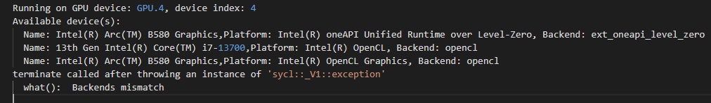

# FAQ

1. If you run different pipelines in a short period of time, you may encounter the following error:
    

    <center>Figure 1: Workload constraints error</center>

    This is because the maxConcurrentWorkload limitation in `AiInference.config` file. If the workloads hit the maximum, task will be canceled due to workload constrains. To solve this problem, you can kill the service with the commands below, and re-execute the command.

    ```bash
    sudo pkill Hce
    ```

2. If you encounter the following error during code compilation, it is because mkl is not installed successfully:
    

    <center>Figure 2: Build failed due to mkl error</center>

    Run `ls /opt/intel` to check if there is a OneAPI directory in the output. If not, it means that mkl was not installed successfully. You need to reinstall mkl by following the steps below:

    ```bash
    curl -k -o GPG-PUB-KEY-INTEL-SW-PRODUCTS.PUB https://apt.repos.intel.com/intel-gpg-keys/GPG-PUB-KEY-INTEL-SW-PRODUCTS.PUB -L
    sudo -E apt-key add GPG-PUB-KEY-INTEL-SW-PRODUCTS.PUB && sudo rm GPG-PUB-KEY-INTEL-SW-PRODUCTS.PUB
    echo "deb https://apt.repos.intel.com/oneapi all main" | sudo tee /etc/apt/sources.list.d/oneAPI.list
    sudo -E apt-get update -y
    sudo -E apt-get install -y intel-oneapi-mkl-devel lsb-release
    ```

3. If the system time is incorrect, you may encounter the following errors during installation:
    

    <center>Figure 3: System Time Error</center>

    You need to set the correct system time, for example:

    ```bash
    sudo timedatectl set-ntp true
    ```

    Then re-run the above installation command.

    ```bash
    sudo apt-get remove --purge intel-oneapi-mkl-devel
    sudo apt-get autoremove -y
    sudo apt-get install -y intel-oneapi-mkl-devel
    ```

4. If you encounter the following errors during running on B580 platform:
    

    <center>Figure 4: Device Index Error</center>

    It may be because the iGPU is not enabled, only the B580 is enabled.

    You can use `lspci | grep VGA` to view the number of GPU devices on the machine.
    
    The solution is either enable iGPU in BIOS, or change the config of `Device=(STRING)GPU.1` to `Device=(STRING)GPU` in `VPLDecoderNode` and `VPLDecoderNode` in pipeline config file, for example: `ai_inference/test/configs/kitti/6C1L/localFusionPipeline.json`.
    
5. If you encounter the following backends mismatch errors during running pipeline:
    

    <center>Figure 5: Backends Mismatch Error</center>

    This is because the wrong or non-existent device is selected. We need to select the `dGPU+opencl` Backend. As shown in the figure, it should be the second device (numbered starting from 0), that is, `GPU.2`.

    The solution is change config `Device=(STRING)GPU.4` to `Device=(STRING)GPU.2` in `LidarSignalProcessingNode` in pipeline config file, for example:  `ai_inference/test/configs/kitti/6C1L/localFusionPipeline.json`.