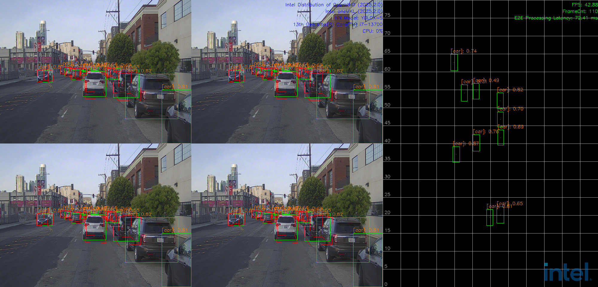

# How It Works

This reference implementation enables the development of a high-performance, Intel-based® Intelligent Traffic Solution. The end-to-end pipeline of this software reference implementation includes the following major workloads, as shown in the following figure: 

- Dataset loading and data format conversion
- Lidar signal processing
- Video analytics
- Data fusion
- Visualization
  

Each pipeline is deployed on a single Intel® SoC processor, providing the necessary heterogeneous compute capabilities from Intel Core™ processors and integrated GPU. The implementation includes video analytics optimized by the Intel® Distribution of OpenVINO™ Toolkit, radar/lidar signal processing accelerated by Intel® oneAPI, data fusion, and visualization. Key performance indicators, such as throughput and processing latency, significantly surpass current market standards. To maximize performance on Intel® processors, we optimized this SW RI using Intel software toolkits and open-source libraries.

Use case: C+L Pipeline

Following are the four demo configurations. Please refer to the [Get Started Guide](./Get-Started-Guide.md) for more instructions on deploying services on bare metal.  

## Demo for 2C+1L

Use case #1: 2C+1L running on Intel® Core™ Ultra 7 265H 

## Demo for 4C+2L

Use case #2: 4C+2L running on Intel® Core™ Ultra 7 265H 

## Demo for 12C+2L

Use case #3: 12C+2L running on Intel® Core™ i7-13700 and Intel® B580 Graphics 

## Demo for 8C+4L

Use case #4: 8C+4L running on Intel® Core™ i7-13700 and Intel® B580 Graphics 

## Key Features

* Powerful and scalable CPU, built-in GPU (iGPU), dGPU configurations that deliver heterogeneous computing capabilities for sensor fusion-based AI inferencing. 

* Low power consumption package with a wide temperature range, compact fanless design, and enhanced vibration resistance. 

* Processors designed for industrial and embedded conditions, ensuring high system reliability. 

* Optimized software reference implementation based on open-source code to support performance evaluation, rapid prototyping, and quick time-to-market. 

* Rugged and compact PC design to withstand harsh in-vehicle environmental conditions. 

## Benefits

* **Enhanced AI Performance**: Achieve superior AI performance with our recommended optimization techniques, rigorously tested on industry-leading AI models and sensor fusion workloads. 

* **Accelerated Time to Market**: Speed up your development process by leveraging our pre-validated SDK and Intel-powered qualified AI Systems, ensuring a quicker path from concept to deployment. 

* **Cost Efficiency**: Lower your development costs with royalty-free developer tools and cost-effective hardware platforms, ideal for prototyping, development, and validation of edge AI traffic solutions. 

* **Simplified Development**: Reduce complexity with our best-known methods and streamlined approach, making it easier to build an intelligent traffic management system.  

##	System Requirements

- Hardware requirements

    - Platform

        - Intel® Core™ Ultra 7 265H + Ubuntu24.04 (2C+1L/4C+2L usecase)
        - Intel® Core™ i7-13700 and Intel® B580 Graphics + Ubuntu24.10 (8C+4L/12C+2L usecase)

- Software requirements

    | Software           | Version                |
    | ------------------ | ---------------------- |
    | Intel  OpenVINO    | 2025.2.0               |
    | Intel  oneAPI      | 2025.1.0               |
    | NEO OpenCL         | Release/23.22.26516.25 |
    | cmake              | 3.22.1                 |
    | boost              | 1.83.0                 |
    | spdlog             | 1.8.2                  |
    | thrift             | 0.18.1                 |
    | gRPC               | 1.58.1                 |
    | zlib               | 1.2.11                 |
    | oneAPI Level  Zero | 1.22.4                 |

## Get Started

- [Get-Started-Guide.md](./Get-Started-Guide.md)
- [Advanced-User-Guide.md](./Advanced-User-Guide.md)
- [APIs.md](./APIs.md)

##	Getting Help

- [FAQ.md](./FAQ.md)

