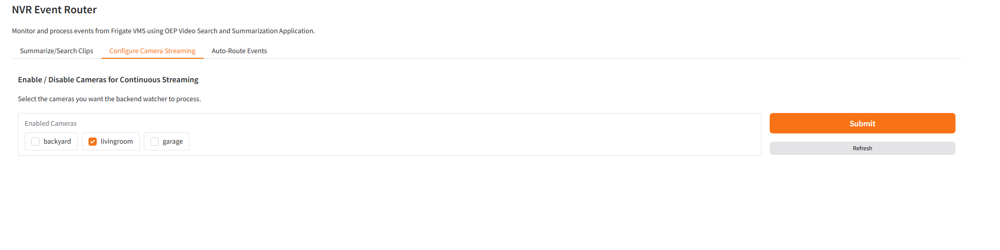

# How to Use the Smart NVR Application

This guide helps you verify deployment, access the application features, and interact with the Smart NVR components.

## Accessing the Application

### Application URL

Open your browser and navigate to:

- **Local access**: [https://localhost:7860](https://localhost:7860)
- **External access**: Replace `localhost` with your server's IP address

### Important Notes

- **Initialization**: Wait few seconds after startup for the MQTT broker to initialize.
- **Recommended Browser**: Google Chrome for optimal experience.

## Application Overview

After successful deployment, you'll see the main landing page:

### Core Features

The Smart NVR application provides three main functionalities:

#### 1. **Video Summarization & Search**

Search and summarize video clips efficiently using AI-powered analysis.

This feature enables users to leverage AI-powered video analysis for intelligent content discovery and summarization. Key capabilities include:

- **Timestamp-based Video Selection**: Select specific timestamps from Frigate NVR recordings to analyze particular time periods of interest
- **Flexible Duration Control**: Define custom video clip lengths starting from your selected timestamp to focus on relevant events
- **AI-Powered Search Integration**: Automatically send selected video clips to the VSS (Video Search Service) search endpoint to expand your searchable video database
- **Intelligent Summarization**: Generate concise, AI-driven summaries of video content to quickly understand key events and activities
- **Pipeline Status Monitoring**: Track the progress and status of video processing operations in real-time
- **Seamless Frigate Integration**: Automatically retrieves video clips from Frigate NVR if they exist in the system

The application intelligently fetches video clips from the Frigate NVR system and processes them through advanced AI pipelines for both search indexing and content summarization.

---

#### 2. **AI-Powered Event Viewer**

The AI-Powered Event Viewer tab visibility is controlled by the NVR_GENAI environment variable (default: false). When enabled (NVR_GENAI=true), the application internally uses the Frigate genai configuration (genai.enabled: true) to power the AI features.

Get intelligent summaries of detected objects and events in your video streams.

This feature provides real-time AI analysis and description of events as they occur across your camera network:

- **Vision Language Model Integration**: Connects to advanced VLM (Vision Language Model) services to provide natural language descriptions of visual events
- **Multi-Camera Support**: Select and monitor events from multiple cameras through an intuitive interface
- **Real-time Event Processing**: Automatically processes and analyzes events as they are detected by the NVR system
- **Detailed Event Descriptions**: Generates human-readable descriptions of detected objects, activities, and behaviors
- **Interactive Event Timeline**: Browse through historical events with AI-generated descriptions for each occurrence
- **Contextual Analysis**: Provides not just object detection but contextual understanding of what's happening in the scene

The system leverages the NVR's built-in detection capabilities and enhances them with AI-powered scene understanding to provide meaningful insights into your video surveillance data.

---

#### 3. **Automated Event Routing**

Create custom rules and workflows for event handling and notifications.

This powerful automation feature enables intelligent event management and workflow creation:

- **Rule-Based Event Processing**: Create custom rules that automatically trigger actions based on specific detection criteria
- **MQTT Broker Integration**: Seamlessly connects to NVR systems via MQTT for real-time event communication
- **VSS Search Integration**: Automatically add relevant event clips to your searchable video database based on predefined rules
- **VSS Summary Integration**: Automatically summarize relevant event clips as per the defined rules
- **Flexible Rule Configuration**: Set up complex rules combining camera selection, object types and VSS integration
- **Multi-Camera Rule Support**: Configure different rules for different cameras across your entire camera network

**Example Use Case**: Configure a rule for Camera 1 to detect person events and automatically send those clips to the search space. Once activated, all person detection events from Camera 1 will be automatically processed and added to your searchable video archive without manual intervention.

---

#### 4. **Configure Camera Streaming (Continuous Ingestion)**

Enable or disable continuous background processing ("watchers") per camera to automatically stream new video segments into the Video Search pipeline.

This feature allows selected cameras to be continuously monitored so their footage is proactively uploaded for Video Search indexing and managed centrally without restarting services or editing configuration files

- **Continuous Ingestion Watcher**: Monitors the NVR folder for each enabled camera and automatically sends new videos to the Video Search pipeline.
- **Real-Time Configuration**: Enable or disable cameras instantly via the UI without restarting any service.
- **Centralized Control**: Manage camera ingestion settings for all cameras in one place through the backend APIs (/watchers/mapping and /watchers/enable).
- **Persistent State Management**: Retains watcher settings across restarts when Redis persistence is active.

**Example Use Case**: Enable continuous ingestion for frequently used cameras to keep their footage always indexed for fast video search, while disabling low-priority ones to conserve resources.

---

## Additional Resources

- **[Troubleshooting Guide](./troubleshooting.md)** - Resolve common deployment and runtime issues
- **[Getting Started](./get-started.md)** - Complete initial setup requirements
- **[Build from Source](./how-to-build-from-source.md)** - Build and deploy the application manually
