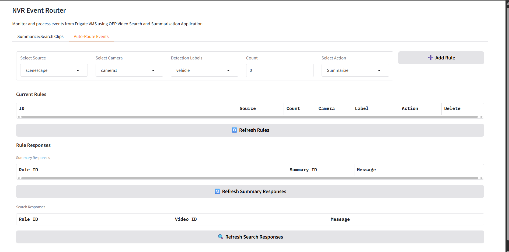
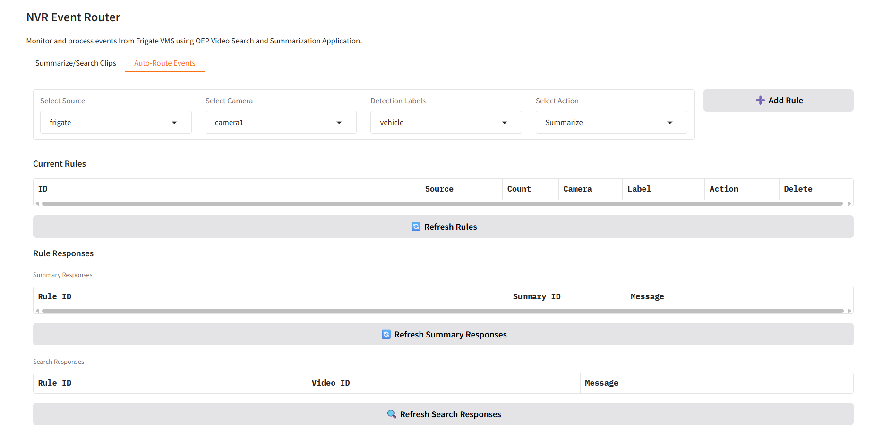
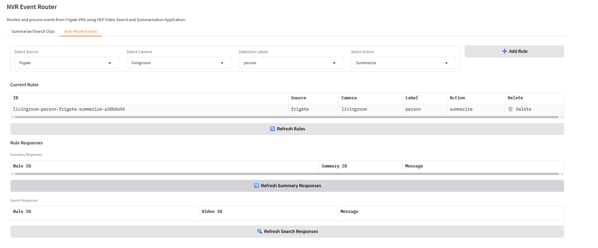

# Scenescape Integration Guide

This guide covers the integration of Intel Scenescape with Smart NVR for enhanced traffic monitoring using live data from smart intersection application.

## Overview

Smart NVR system integrates with Intel Scenescape to enable:
- Real-time object counting and tracking (vehicles, pedestrians)
- Traffic flow analysis
- Automated event routing based on count thresholds
- Enhanced surveillance for smart intersection management

## Prerequisites

- **Smart Intersection Reference Implementation**: We will use the Smart Intersection application to showcase the SceneScape integration.

> **Please follow the below steps to run Smart Intersection Application.**

```bash
# Clone smart intersection repository inside smart nvr directory if not already done
git clone https://github.com/open-edge-platform/edge-ai-suites.git -b v1.2.0

# From the Smart NVR directory, copy the DLStreamer configuration (enables RTSP streaming)
cp ./resources/si-rtsp-config.json edge-ai-suites/metro-ai-suite/metro-vision-ai-app-recipe/smart-intersection/src/dlstreamer-pipeline-server/config.json

# Copy the SceneScape compose configuration
cp ./resources/compose-scenescape-rtsp.yml edge-ai-suites/metro-ai-suite/metro-vision-ai-app-recipe/compose-scenescape.yml
```

After copying the files, start the Smart Intersection application:

```bash
# Navigate to metro-vision-ai-app-recipe directory
cd edge-ai-suites/metro-ai-suite/metro-vision-ai-app-recipe/

# Start Smart Intersection
./install.sh smart-intersection
docker compose up -d

# Navigate back to Smart NVR
cd ../../../../smart-nvr
```

These files provide:

- RTSP streaming support in the DLStreamer pipeline
- SceneScape-specific Docker Compose settings

## Installation and Setup

### Step 1: Get MQTT Credentials

```bash
# Get MQTT credentials from Smart Intersection
cat edge-ai-suites/metro-ai-suite/metro-vision-ai-app-recipe/smart-intersection/src/secrets/browser.auth
# Expected: {"user": "<user>", "password": "<password>"}
```

### Step 2: Configure Environment Variables

```bash
# Enable Scenescape Integration
export NVR_SCENESCAPE=true

# MQTT Configuration (from browser.auth JSON)
export SCENESCAPE_MQTT_USER="<user>"
export SCENESCAPE_MQTT_PASSWORD="<password>"
export SCENESCAPE_THROTTLE_INTERVAL=2.0  # Optional: throttle interval in seconds
```

### Step 3: Start Smart NVR

```bash
# Start the application
./setup.sh start

# Or restart with new configuration
./setup.sh restart
```

**Note:** The setup script automatically copies Scenescape certificates from Smart Intersection if available. If certificates are missing, setup will fail with an error message.

### Step 4: Verify Integration

Check logs to confirm Scenescape connection:

```bash
docker logs nvr-event-router -f
# Look for: "Scenescape MQTT client started"
```

## User Interface Changes

### With Scenescape Enabled and Scenescape Source Selected



When Scenescape is enabled (`NVR_SCENESCAPE=true`) and scenescape source is selected:

- Source dropdown shows both **"frigate"** and **"scenescape"** options
- **Count** field becomes visible and editable
- Users can set minimum count threshold for rule triggering (e.g., 5, 10, 15)
- Rules table includes "Count" column for tracking thresholds
- Count validation ensures non-negative integers only

### With Scenescape Enabled but Frigate Source Selected



When Scenescape is enabled but frigate source is selected:

- Source dropdown still shows both **"frigate"** and **"scenescape"** options
- **Count** field is automatically hidden (not applicable for frigate)
- Standard frigate rule configuration with detection labels
- Rules table shows "Count" column but displays "-" for frigate rules
- Full frigate functionality remains available

### With Scenescape Completely Disabled (`NVR_SCENESCAPE=false`)



When Scenescape is disabled in environment variables:

- Source dropdown shows **only** "frigate" option
- Count field is never visible
- Rules table **excludes** the "Count" column entirely
- Pure frigate-only functionality and interface
- Scenescape MQTT client will not start

## Auto-Route Events Configuration

### Creating Rules

**Steps (both sources):**

1. Navigate to **Auto-Route Events** tab
2. **Select Source:** "scenescape" or "frigate"
3. **Set Count:** (Scenescape only) Define minimum threshold (e.g., 5)
4. **Select Camera:** Choose target camera
5. **Choose Detection Label:** Select object type
6. **Select Action:** "Summarize" or "Add to Search"
7. **Click Add Rule**

**Key Differences:**

- **Scenescape:** Count field visible when selected
- **Frigate:** Count field hidden

### Rule Behavior Examples

**Scenescape Rule Example:**

```
Source: scenescape
Camera: camera1
Count: 5
Label: vehicle
Action: Summarize
```

*Triggers video summarization when 5+ vehicles detected in camera1*

**Frigate Rule Example:**

```
Source: frigate
Camera: livingroom
Label: person
Action: Add to Search
```

*Adds person detection events to search index for livingroom camera*

## Troubleshooting

### Common Issues

**Scenescape features not visible:**
```bash
# Check and set environment variable
echo $NVR_SCENESCAPE  # Should show 'true'
export NVR_SCENESCAPE=true
./setup.sh restart
# Refresh browser (Ctrl+F5)
```

**No scenescape events received:**

```bash
# Check MQTT connection
docker logs nvr-event-router | grep -i scenescape
```

### Debug Commands

```bash
# Check environment variables
env | grep NVR_SCENESCAPE
env | grep SCENESCAPE

# Monitor MQTT messages
docker logs nvr-event-router -f | grep "scenescape"

# Check UI logs
docker logs nvr-event-router-ui -f

# Verify Scenescape MQTT connection
docker logs nvr-event-router | grep "Scenescape MQTT client"
```

## Monitoring Commands

```bash
# Check system CPU usage and load
cat /proc/loadavg && docker stats --no-stream --format "table {{.Name}}\t{{.CPUPerc}}\t{{.MemUsage}}"
```

## Support

For Scenescape integration issues:

1. **Certificate Error**: Ensure Smart Intersection application is running and has generated certificates
2. **Environment Variables**: Verify `NVR_SCENESCAPE=true` and MQTT credentials are set
3. **MQTT Connection**: Check logs for "Scenescape MQTT client started" message
4. **Smart Intersection**: Confirm Smart Intersection application is accessible at expected path
5. **Performance Issues**: Run `cat /proc/loadavg && docker stats --no-stream` to check CPU usage and system load
6. **High Resource Usage**: If load average >10 or containers show >500% CPU, restart high-usage containers
7. Review logs using debug commands above and contact support with relevant excerpts

For general Smart NVR issues, see the [main documentation](get-started.md).

---

*Last updated: October 2025*
